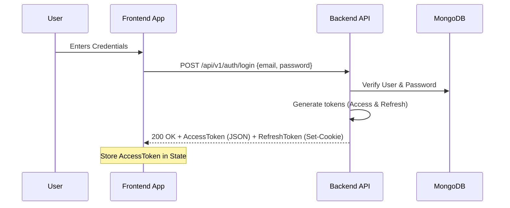
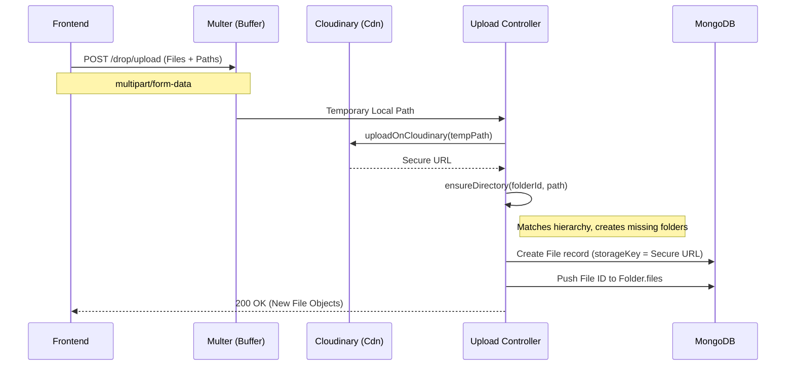
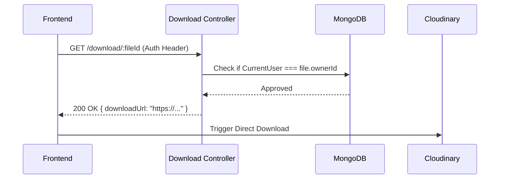

# LabDrop Backend: Technical Integration Guide

This guide provides a deep-dive into the LabDrop backend architecture. It is designed to help the frontend team integrate the system following the "Smart Drop" and "Stateless Storage" paradigms.

---

## 🔐 1. Authentication & Authorization

LabDrop uses **JWT (JSON Web Tokens)** with a dual-token strategy.

### The Mechanism:
- **Access Token**: Sent as a JSON response. The frontend must store this in a secure variable (e.g., Redux state) and send it in the `Authorization: Bearer <token>` header for every request.
- **Refresh Token**: Sent as an `HttpOnly` cookie. This token is used to automatically generate new access tokens when they expire.

### Transaction Flow:


---

## 📁 2. File Upload Transactions

We support two distinct upload flows: **Single File** and **Recursive "Smart Drop"**.

### Flow A: Single File Upload
Used when a user uploads a file directly into a folder.
- **`folderId`**: The ID of the current folder.
- **`paths`**: Not strictly required (defaults to file name).

### Flow B: "Smart Drop" (Folder Upload)
Used when a user drags a whole folder into the workbench.
- **`folderId`**: The "Home" folder or target root.
- **`paths`**: **CRITICAL**. An array of full relative paths (e.g., `Project1/src/main.js`).

### Detailed Upload Transaction (Sequence):


---

## 📥 3. Stateless Download Flow

Since files are in the Cloud, the backend acts as a **Permission Guard**, not a file server.

### Transaction Logic:
1. Frontend requests a file by ID.
2. Backend verifies ownership.
3. Backend returns the Cloudinary URL.
4. Frontend triggers the browser download.



---

## 📝 4. API Endpoints Reference

### User & Auth
- `POST /api/v1/auth/signup`: Create a new account.
- `POST /api/v1/auth/login`: Start a session.
- `POST /api/v1/auth/logout`: End session (clears cookie).
- `POST /api/v1/auth/refresh-token`: Get new Access Token using Cookie.

### Folders & Workbench
- `GET /api/v1/folder/:folderId?`: Get contents (Folders + Files).
- `POST /api/v1/folder/create`: Manual folder creation.
- `PATCH /api/v1/folder/rename/:folderId`: Rename (cascades to all children).
- `DELETE /api/v1/folder/:folderId`: Soft delete (cascades to all children).

### Files
- `POST /drop/upload`: The core upload engine.
- `GET /download/:fileId`: Permission-secured download link retrieval.
- `PATCH /api/v1/file/rename/:fileId`: Rename single file.
- `DELETE /api/v1/file/:fileId`: Soft delete single file.

---

## 🛠️ Frontend Implementation Requirements

### 1. The `paths` requirement:
When using `<input type="file" webkitdirectory />`, you must iterate through the files and append the `webkitRelativePath` to the `FormData`. 

**Example Payload Structure:**
```javascript
const fd = new FormData();
fd.append("folderId", "65b2f..."); // parent
files.forEach(f => {
    fd.append("files", f);
    fd.append("paths", f.webkitRelativePath); // e.g., "src/main.js"
});
```

### 2. Error Handling:
- **`401 Unauthorized`**: Indicates the Access Token is expired. Call `/refresh-token` and retry.
- **`409 Conflict`**: Indicates a naming collision in the current folder. Prompt user to rename.
- **`413 Payload Too Large`**: Max 50 files or 10MB per file.

### 3. Handling Downloads:
Do NOT use `window.location.href = /download/fileId`. 
Instead:
1. `const { data } = await axios.get('/download/fileId')`
2. `window.open(data.downloadUrl, '_blank')`
